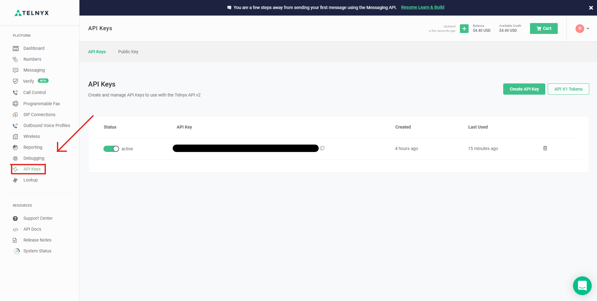
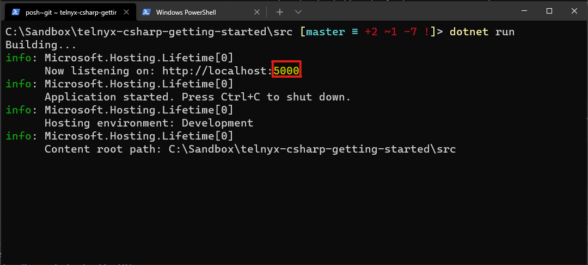
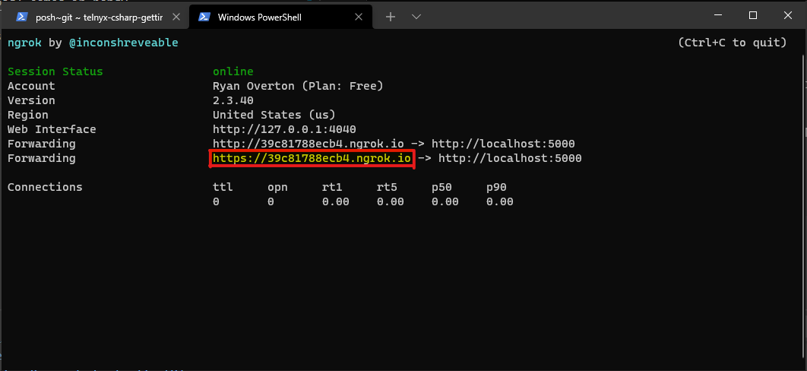
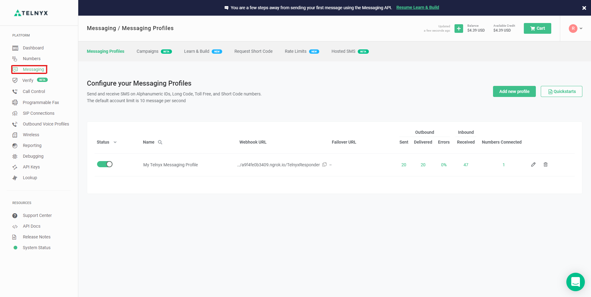
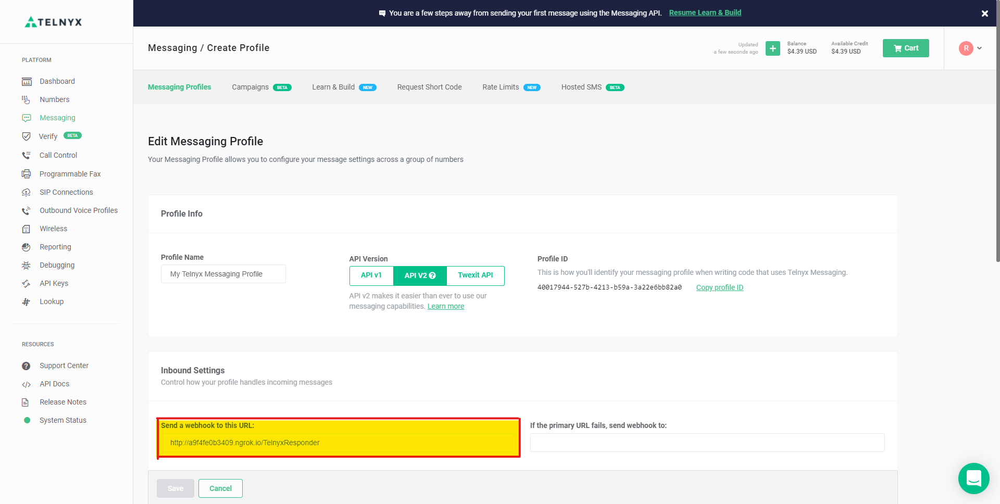

# SMS messaging using Telnyx and C#
This repository is an example of how to receive and send SMS messages using Telnyx and C#.

## Pre-requisites
- [Telnyx account](https://telnyx.com/sign-up)
- [.NET 5](https://dotnet.microsoft.com/download/dotnet/5.0)
- Tunneling service ([NGROK](https://ngrok.com/download) recommended)

**_Note: Ensure you have signed-up, downloaded, and installed all the pre-requisites listed above, including purchasing a phone number from Telnyx. This is how you will be able to send and recieve SMS messages_**

## Setting up and running the application

To get started, you'll first need to clone this repository

```
git clone https://github.com/OnyxPrime/telnyx-csharp-getting-started.git
```
Next, head over to the Telnyx portal and copy the API key for your account



Replace the placeholder value for the `TELNYX_API_KEY` in `appsettings.json` with your Telnyx API key.

```
{
  ...,
  "TELNYX_API_KEY": "PUT_YOUR_TELNYX_API_KEY_HERE"
}
```

Open up your favorite terminal, switch to the `src` directory under this repository, and run the following commands

```
dotnet build
dotnet run
```

Once the application, is running note down the port it is serving the application on.



With the .NET application running, we need to create a tunnel between our localhost port and the outside world. This is where [NGROK](https://ngrok.com/download) comes in handy.

Open a second terminal window, switch to the directory where you unpacked NGROK earlier, and run the following command.

```
ngrok http 5000
```

With NGROK running, we now have a way to allow the Telnyx webhook to communicate with the web API running locally on our machine. 

Now we need to tell Telnyx where to send the incoming SMS messages. Copy the public URL NGROK created for us from the terminal window.



Go back to your Telnyx portal and select the `Messaging` tab.



Click on your messaging profile to edit it, paste the URL provided by NGROK copied earlier in the `Send a webhook to the URL:` field, add the controller name (`TelnyxResponder`) to the end of the URL, and click the `Save` button.



## Testing the application

To test the application, send an SMS message to phone number you purchased from Telnyx. 

SMS Message|Response
-------|--------
`pizza`|Chicago pizza is the best
`ice cream`|I prefer gelato
any other phrase|Please send either the word ‘pizza’ or ‘ice cream’ for a different response


